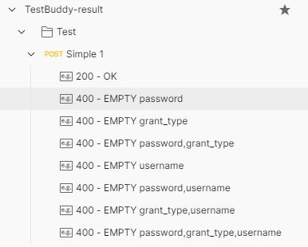

# TestBuddy
Your buddy helps you to simplifiy your test design and test coverage.

## Scope
Covering test cases (positive & negative) is crucial during test design and after that, test development. Covering all test cases and possible scenarios, while an REST request has different parameters, is not easy to anlayze. TestBuddy checks all the parameters and for each parameter, generate a new test case, runs it and will provide a report of the request and response.

First phase, focuses on importing requests from **Postman** collection and saving the test cases as **Example** for each request.

## Test Case Analysis
A parameter of a request can be a string, number, boolean, array, object, etc. Providing correct parameter leads to a positive test, while incorrect one (for any possible reason) can lead to negative test case.

### Sceanrios:
- All parameters are OK (+)
- Empty parameter (-)
    - the parameter exists but it is empty
- Invalid parameter (-)
    - the parameter exists and it is invalid
- Missing parameter (-)
    - the parameter does not exist
- and more ...

### Example
> Note: This example assumes only with correct parameters, the test will be positive (response is 200 OK)

Considering a request with 3 parameters, will produce 8 test cases (2^3). The following table shows the test cases for each parameter and final result of each combination. Only the first case is *positive* and the rest are *negative*.

|   | 0  | 1  | 2  | 3  | 4  | 5  | 6  | 7  |
| :------------: | :------------: | :------------: | :------------: | :------------: | :------------: | :------------: | :------------: | :------------: |
| P1  | T  | F  | T  | F  | T  | F  | T  | F  |
| P2  | T  | T  | F  | F  | T  | T  | F  | F  |
| P3  | T  | T  | T  | T  | F  | F  | F  | F  |
| Result  | **T**  | **F**  | **F**  | **F**  | **F**  | **F**  | **F**  | **F**  |

## Result
The end result will be auto-generated JSON file of the collection containing all the test cases

