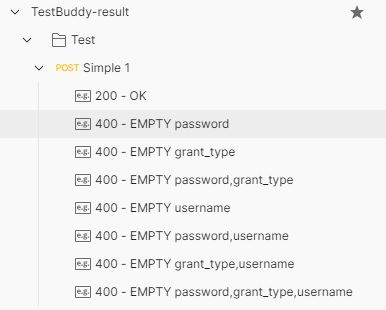

[license]: http://www.apache.org/licenses/LICENSE-2.0 "Apache License 2.0"
[site]: https://github.com/jalizadeh/TestBuddy
[build]: https://github.com/jalizadeh/TestBuddy/actions/workflows/ci.yml
[build-badge]: https://github.com/jalizadeh/TestBuddy/actions/workflows/ci.yml/badge.svg


# TestBuddy

[![build-badge][]][build]

Your buddy helps you to simplify your test design and test coverage.

## Scope
Covering test cases (positive & negative) is crucial during test design and after that, test development. Covering all test cases and possible scenarios, while an REST request has different parameters, is not easy to analyze. TestBuddy checks all the parameters and for each parameter, generate a new test case, runs it and will provide a report of the request and response.

First phase, focuses on importing requests from **Postman** collection and saving the test cases as **Example** for each request.

## Test Case Analysis
A parameter of a request can be a string, number, boolean, array, object, etc. Providing correct parameter leads to a positive test, while incorrect one (for any possible reason) can lead to negative test case.

### Scenarios:
- [x] All parameters are OK (+)
- [x] Empty parameter (-)
    - the parameter exists but it is empty
- [x] Invalid parameter (-)
    - the parameter exists and it is invalid
- [x] Missing parameter (-)
    - the parameter does not exist
- [x] Random parameter (-)
    - the parameter is a random value (first part of UUID)
- [ ] Extra dummy parameter(s) (-/+)
    - the extra dummy parameter`s presence brakes the functionality or not
- and more ...

The checked scenarios above are implemented via the **iFilter** interface.


### Example
> Note: This example assumes only with correct parameters, the test will be positive (response is 200 OK)

Considering a request with 3 parameters, will produce 8 test cases (2^3). The following table shows the test cases for each parameter and final result of each combination. Only the first case is *positive* and the rest are *negative*.

|   | 0  | 1  | 2  | 3  | 4  | 5  | 6  | 7  |
| :------------: | :------------: | :------------: | :------------: | :------------: | :------------: | :------------: | :------------: | :------------: |
| P1  | T  | F  | T  | F  | T  | F  | T  | F  |
| P2  | T  | T  | F  | F  | T  | T  | F  | F  |
| P3  | T  | T  | T  | T  | F  | F  | F  | F  |
| Result  | **T**  | **F**  | **F**  | **F**  | **F**  | **F**  | **F**  | **F**  |

## Result
The end result will be auto-generated JSON file of the collection containing all the test cases as Postman`s Example

```
curl -X POST 'localhost:8080/json?delay=1' \
-H 'Content-Type: application/json' \
--data-raw '{
    "filters" : [
        "EMPTY",
        "RANDOM",
        "INVALID",
        "MISSING"
    ]
}'
```

Response

```json
{
    "collectionName": "TestBuddy_20221123_220044",
    "totalTimeMs": 493,
    "totalRequests": 7,
    "totalCalls": 67,
    "totalPositive": 7,
    "totalNegative": 60,
    "requests": [
        {
            "name": "Authorized",
            "method": "GET",
            "url": "http://localhost:8080/authorized/basic",
            "positive": 1,
            "negative": 4,
            "status": [
                "200 OK",
                "400 BAD_REQUEST",
                "403 FORBIDDEN",
                "500 INTERNAL_SERVER_ERROR"
            ]
        },
        {
            "name": "Delete",
            "method": "DELETE",
            "url": "http://localhost:8080/delete",
            "positive": 1,
            "negative": 0,
            "status": [
                "200 OK"
            ]
        },
        {
            "name": "Raw Body",
            "method": "POST",
            "url": "http://localhost:8080/rawBody",
            "positive": 1,
            "negative": 28,
            "status": [
                "200 OK",
                "400 BAD_REQUEST",
                "401 UNAUTHORIZED"
            ]
        },
        {
            "name": "Simple",
            "method": "GET",
            "url": "http://localhost:8080/simple",
            "positive": 1,
            "negative": 0,
            "status": [
                "200 OK"
            ]
        },
        {
            "name": "Simple - No Path",
            "method": "GET",
            "url": "http://localhost:8080",
            "positive": 1,
            "negative": 0,
            "status": [
                "200 OK"
            ]
        },
        {
            "name": "Update",
            "method": "PUT",
            "url": "http://localhost:8080/update",
            "positive": 1,
            "negative": 0,
            "status": [
                "200 OK"
            ]
        },
        {
            "name": "X-Form",
            "method": "POST",
            "url": "http://localhost:8080/xform",
            "positive": 1,
            "negative": 28,
            "status": [
                "200 OK",
                "400 BAD_REQUEST",
                "401 UNAUTHORIZED"
            ]
        }
    ]
}
```


[Sample generated JSON file to load in Postman](assets/result-full.json)

Generated result is loaded in Postman:




## Request Types based on body format

**empty**
- The request doesn`t have body data

**raw**
- The body is plain text
- **&amp;** separated

**x-www-form-urlencoded**
- key-value pairs
- parameters can be disabled (*not implemented yet*)


## TODO

Test Endpoint
- [x] /rawBody for requests with *raw* body
- [x] /xForm for requests with *x-www-form-urlencoded* body
- [ ] RestAssured tests
	- [x] test endpoints
	- [x] /json endpoint
		- [x] load & parse JSON file
		- [x] empty/single/multiple filters
		- [x] ignore duplicate filter
	- [ ] generated Postman collection
	- [ ] generated HTML report (Selenium)


**Postman Collection Parser**
- [ ] Parse Postman collection
	- [x] Parse the 1st collection
	- [ ] Choose the `Collection` name (in multi-item collections)
- [x] Support all request methods
	- [x] GET
	- [x] POST
	- [x] PUT
	- [x] DELETE
- [x] Parse request bodies
	- [x] Empty
	- [x] *raw* body
	- [x] Parse *x-www-form-urlencoded* body
- [x] Use of parameter's `Description` to extend parsing
	- This feature is needed to let the parser understand the data type (up to now)`{"type":"integer"}`
- [x] Export populated Postman collection
- [x] Add response's headers to PostmanResponse object
- [x] Use requests's header in RestService
- [x] Prettify result JSON file
- [x] Statistics
	- [x] Set of `{ filter : [response status] }`
- [x] HTML Report
- [ ] Load Postman environment file
- [ ] Log
- [ ] Group similar results

**Filters**
- [ ] Filter request
	- [x] List of desired filters
	- [ ] Apply on target parameters
		- [x] body
		- [x] query
			- It is necessary to know the type of the `key` using `Description`
		- [x] header
			- [x] ⚠️ Currently supports only `Authorization` header
			- [ ] Support multi-header item
- [x] Allow empty filter list (run only positive case)
- [ ] Boundary tests
- [ ] Extra parameter test
- [ ] Test inventory (providing desired input data)
	- [ ] 💡 IDEA: using parameter's (query/header/body) `Description` section for specific JSON-based rules/identification, like: `{"type":"integer","ignore":true}`
	

## Run
- mvn spring-boot:run
- mvn clean test
- mvn clean site
	- Run and generate styled report
- mvn sonar:sonar -Dsonar.login=admin -Dsonar.password=12345